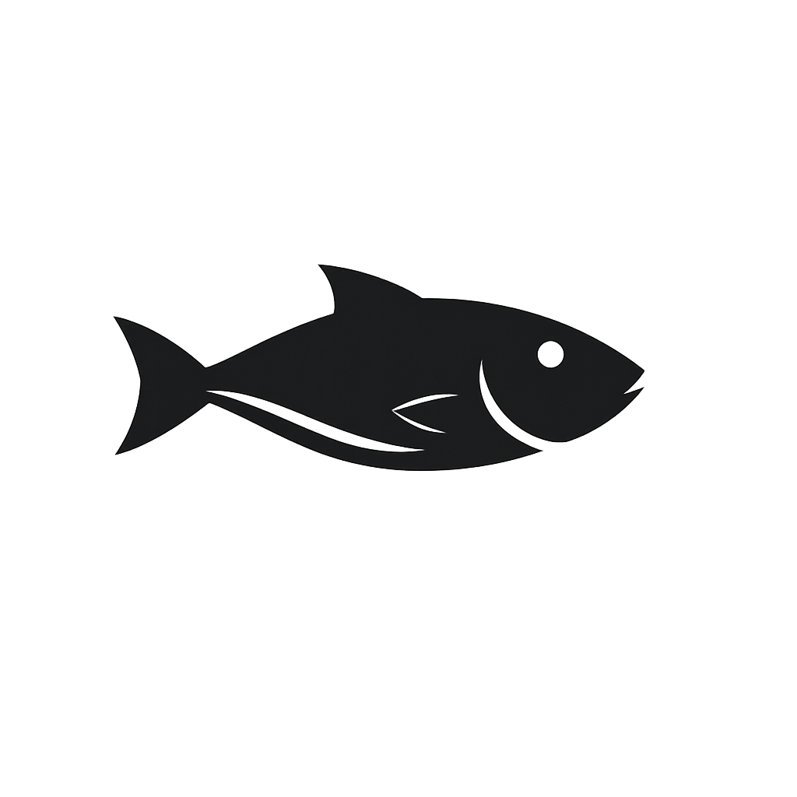
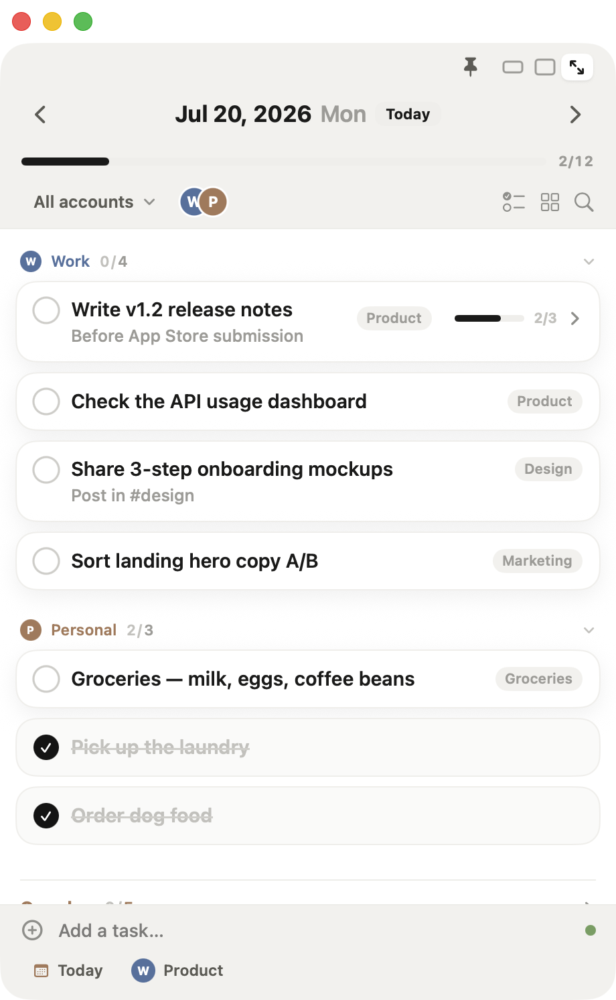
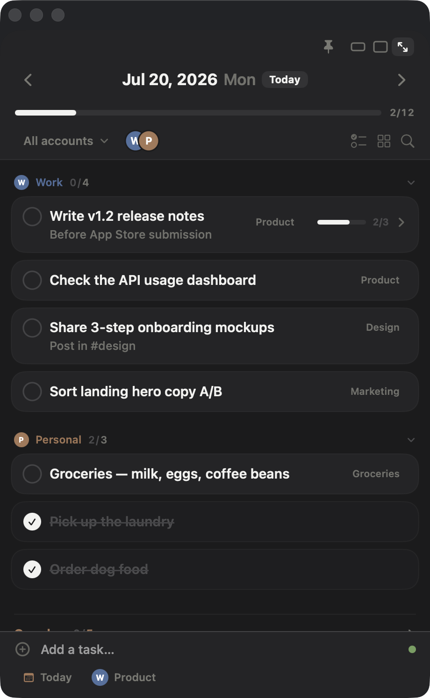

<div align="center">
  
  <h1>TaskOcean</h1>
  <p><b>Google Tasks를 화면 위에 늘 띄워두는 작고 조용한 macOS 유틸리티</b></p>
  <p><i>A small, quiet always-on-top Google Tasks companion for macOS.</i></p>
</div>

<p align="center">
  
  
</p>

---

## 무엇을 하나요

- **항상 위에 떠 있는 작은 창** — 다른 앱 위를 가리지 않게 조용히. 미니 / 컴팩트 / 확장 3가지 모드.
- **3초 캡처** — 전역 단축키로 어디서든 할 일을 바로 추가(자연어 입력 지원).
- **여러 Google 계정을 한 화면** — 업무·개인 계정을 액센트 색으로 구분해 함께.
- **하루에 집중** — `지남(Overdue) → 오늘 → 기한 없음` 순으로 오늘 할 일만.
- 서브태스크, 완료 정리, 계정 간 이동, 드래그 정렬, 검색, 활동 히트맵.
- 메뉴바 아이콘 · Dock 배지 · 로컬 알림, 라이트/다크, 한국어/영어.
- 항상 위 · 투명도 · 자동 페이드로 **방해는 최소**.

가볍고 네이티브입니다(SwiftUI, App Sandbox). 유휴 상태에서 조용합니다.

## 요구 사항

- macOS 14 (Sonoma) 이상

## 설치

Homebrew Cask로 설치합니다(공증된 Developer ID 빌드):

```bash
brew install --cask kingsfavor/tap/taskocean
```

또는:

```bash
brew tap kingsfavor/tap
brew install --cask taskocean
```

## 업데이트

새 버전이 나오면 앱이 **조용히 알려줍니다** — 하루 한 번만 확인하고, 팝업으로 방해하지 않습니다.
새 버전이 있을 때만 창 상단에 얇은 안내 줄이 뜨고(✕로 닫으면 그 버전은 다시 뜨지 않음),
*설정 › 일반 › 업데이트*에서 현재 버전 확인·수동 확인·자동 확인 끄기를 할 수 있습니다.

업데이트 방법:

```bash
brew upgrade --cask taskocean
```

또는 [릴리스 페이지](https://github.com/KingsFavor/Taskocean/releases/latest)에서 최신 DMG를 받아 덮어쓰면 됩니다.

## 현재 상태 — 프리뷰

> ⚠️ 지금 빌드는 **샘플(목업) 데이터**로 UI가 동작합니다. 실제 Google Tasks 계정 연동·동기화는 **개발 중**입니다.
> 화면과 상호작용을 미리 둘러보는 용도로 사용하세요.

## 사용 팁

- **전역 단축키**로 창을 어디서든 불러오고 바로 캡처합니다. 기본값은 *설정 › 단축키*에서 확인·변경할 수 있습니다.
- 창 모드(미니/컴팩트/확장)와 항상 위·투명도는 창 안에서 바로 전환됩니다.
- 메뉴바 아이콘에서 열기·빠른 동작에 접근할 수 있습니다.

## 개발 · 문서

개발 관련 자료는 [`docs/`](docs/)에 정리되어 있습니다 — 제품 요구사항, 디자인 레퍼런스, 진행 로그, 배포/CI 가이드 등. 목차는 [docs/README.md](docs/README.md) 참고.

## 라이선스

© 2026 DWS(KR). All rights reserved.
